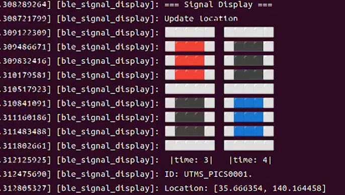

# BLEによる交通信号機の解析パッケージ for ROS 2

高度化PICS対応交差点の信号機から発せられるBLE（Bluetooth Low Energy）信号を受信・解析し、信号機のID、座標、色状態、切替時間などをROS 2トピックとしてパブリッシュするROS 2パッケージ

## 概要
- Company IDが`0x01CE`のBLE信号を定期的にスキャン・解析
- 以下の情報を個別のトピックで発信
    - 信号機ID(UTMS_PICS001)
    - 緯度経度
    - 信号機の色、残り時間
    - [テスト動画(YouTube)](https://youtu.be/ce-LPqhP7Pc)
    - 
    

## ノード

### BLEutms
信号機のBLEをスキャン、解析、パブリッシュを行うメインノード

#### パブリッシュするトピック
- `/BLEutms_status` (std_msgs/UInt8MultiArray)
    - 信号機の状態を数値で配信
    - BLEで受信した生のバイトを10進数に変換したの5つの要素の配列
    - サブスクライバ側で16進数に変換し、使用することを推奨 下記は16進数に変換することを前提に表記する
        - 1桁目が信号機の色を表す
            - `1=赤, 2=点滅(黄色), 3=青`
        - 2桁目が残りの時間を表す
        - FFの場合は その信号の状態が存在しないことを表す
        - 例
            - `0x41` 残り時間4 赤
            - `0x93` 残り時間9 青 

    - 出力例
        - 16進数への変換前(10進数)
            ```
            data:
            - 65
            - 99
            - 255
            - 255
            - 255
            - 255
            ```
        - 16進数へ変換後
            ```
            data:
            - 41
            - 63
            - FF
            - FF
            - FF
            - FF
            ```
        
- `/BLEutms_color` (std_msgs/String)
    - 信号機の色を文字列で配信
    - 出力例
        ```
        data: red,blue,none,none,none,none
        ```

- `/BLEutms_time` (std_msgs/UInt8MultiArray)
    - 信号機の残り時間を5つの配列で配信
    - 出力例
        ```
        data:
        - 4
        - 6
        - 0
        - 0
        - 0
        - 0
        ```

- `/BLEutms_ID` (std_msgs/String)
    - 信号機のID
    - 出力例
        ```
        data: UTMS_PICS0001
        ``` 

- `/BLEutms_location` (std_msgs/Float64MultiArray)
    - 緯度経度を出力
    - [緯度, 経度] の順の配列
    - 出力例
        ```
        data: 
        - 35.619713
        - 140.106892
        ```

#### デバッグ用
- `/BLEutms_debug`
    - BLE対応の信号機がない場合のデバッグ用でサブスクライブ
    - `,`で区切られたBLEで取得できるものと同じ24バイトのデータを配信することで信号機がなくてもノードを実行できる
    - 使用コマンド例
        ```
        ros2 topic pub /BLEutms_debug std_msgs/String "data: '58,01,00,E4,00,00,00,B8,A6,2F,55,54,4D,53,5F,50,49,43,53,30,30,30,31,00'"
        ```
    

### BLEutms_sub
上記のトピックをすべてサブスクライブし、ログに出力

### BLEutms_display
`/BLEutms_status` `/BLEutms_ID` `/BLEutms_time` `/BLEutms_ID` `/BLEutms_location` をサブスクライブし、AAを用いて表示

## テスト環境
- Ubuntu 22.04 LTS
- ROS 2 Humble

## ライセンス
- このソフトウェアパッケージは，3条項BSDライセンスの下，再頒布および使用が許可されます．
- © 2025 tento